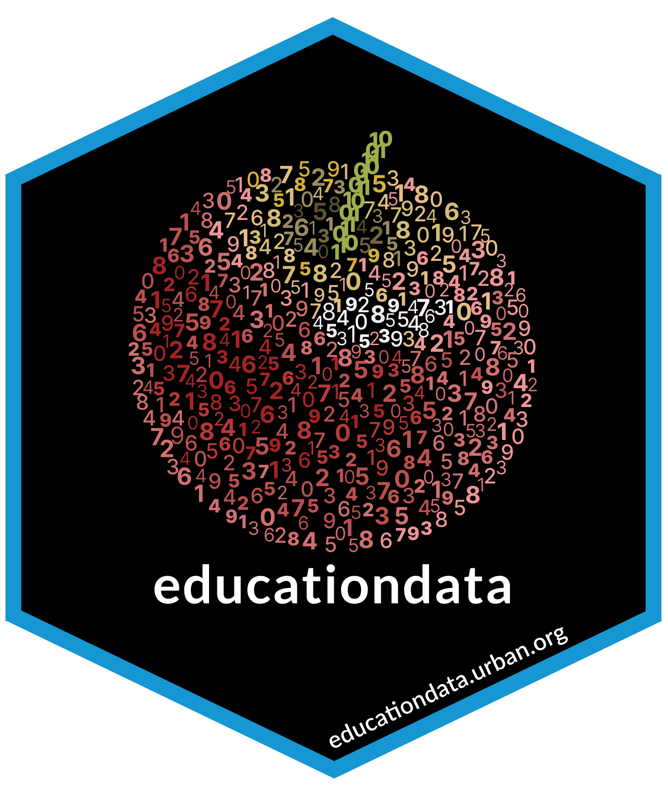

<!-- README.md is generated from README.Rmd. Please edit that file -->

```{r, echo = FALSE}
knitr::opts_chunk$set(
  collapse = TRUE,
  comment = '#>',
  fig.path = 'README-'
)
```

# educationdata 

<!-- badges: start -->
[](https://github.com/UrbanInstitute/education-data-package-r/actions)
[](https://cran.r-project.org/package=educationdata)
<!-- badges: end -->

Retrieve data from the Urban Institute's [Education Data API](https://educationdata.urban.org/) as a `data.frame` for easy analysis.

**NOTE**: By downloading and using this programming package, you agree to abide
by the [Data Policy and Terms of Use of the Education Data Portal](https://educationdata.urban.org/documentation/#terms).

## Installation

You can install the released version of `educationdata` from [CRAN](https://CRAN.R-project.org/package=educationdata) with: 

```{r cran-installation, eval=FALSE}
install.packages("educationdata")
```

And the development version from GitHub with: 

```{r gh-installation, eval=FALSE}
# install.packages('devtools') # if necessary
devtools::install_github('UrbanInstitute/education-data-package-r')
```

## Usage

```{r quickstart-01, message=FALSE}
library(educationdata)

df <- get_education_data(level = 'schools', 
                         source = 'ccd', 
                         topic = 'enrollment', 
                         subtopic = list('race', 'sex'),
                         filters = list(year = 2008,
                                        grade = 9:12,
                                        ncessch = '340606000122'),
                         add_labels = TRUE)

str(df)
```

The `get_education_data()` function will return a `data.frame` from a call to 
the Education Data API.  

```{r quickstart-02, eval=FALSE}
get_education_data(level, source, topic, subtopic, filters, add_labels)
```

where:

* level (required) - API data level to query.
* source (required) - API data source to query.
* topic (required) - API data topic to query.
* subtopic (optional) - Optional `list` of grouping parameters for an API call.
* filters (optional) - Optional `list` query to filter the results from an API 
call.
* add_labels - Add variable labels (when applicable)? Defaults to `FALSE`.
* csv - Download the full csv file? Defaults to `FALSE`.
* verbose - Print messages and warnings? Defaults to `TRUE`.

## Available Endpoints

```{r endpoints, echo=FALSE}
source('R/get-endpoint-info.R')
df <- get_endpoint_info("https://educationdata.urban.org")

df$years_available <- gsub('and' ,'', df$years_available)
df$years_available <- gsub('\u20AC' ,'-', df$years_available)
df$years_available <- gsub('\u00E2' ,'', df$years_available)
df$years_available <- gsub('\u201C' ,'', df$years_available)
df$optional_vars <- lapply(df$optional_vars, 
                           function(x) paste(x, collapse = ', '))
df$required_vars <- lapply(df$required_vars, 
                           function(x) paste(x, collapse = ', '))
df <- df[order(df$endpoint_url), ]

vars <- c('section', 
          'class_name', 
          'topic', 
          'optional_vars',
          'required_vars',
          'years_available')

knitr::kable(df[vars], 
             col.names = c('Level', 
                           'Source', 
                           'Topic', 
                           'Subtopic',
                           'Main Filters',
                           'Years Available'),
             row.names = FALSE)
```

## Main Filters

Due to the way the API is set-up, the variables listed within 'main filters'
are the fastest way to subset an API call.

In addition to `year`, the other main filters for certain endpoints 
accept the following values:

### Grade
| Filter Argument | Grade |
|-------------------|-------|
| `grade = 'grade-pk'` | Pre-K  |
| `grade = 'grade-k'`  | Kindergarten  |
| `grade = 'grade-1'` | Grade 1  |
| `grade = 'grade-2'` | Grade 2  |
| `grade = 'grade-3'` | Grade 3  |
| `grade = 'grade-4'` | Grade 4  |
| `grade = 'grade-5'` | Grade 5  |
| `grade = 'grade-6'` | Grade 6  |
| `grade = 'grade-7'` | Grade 7  |
| `grade = 'grade-8'` | Grade 8  |
| `grade = 'grade-9'` | Grade 9  |
| `grade = 'grade-10'` | Grade 10  |
| `grade = 'grade-11'` | Grade 11  |
| `grade = 'grade-12'` | Grade 12  |
| `grade = 'grade-13'` | Grade 13  |
| `grade = 'grade-14'` | Adult Education |
| `grade = 'grade-15'` | Ungraded  |
| `grade = 'grade-99'` | Total  |

### Level of Study
| Filter Argument | Level of Study |
|-------------------|----------------| 
| `level_of_study = 'undergraduate'` | Undergraduate |
| `level_of_study = 'graduate'` | Graduate |
| `level_of_study = 'first-professional'` | First Professional |
| `level_of_study = 'post-baccalaureate'` | Post-baccalaureate |
| `level_of_study = '99'` | Total |


## Examples

Let's build up some examples, from the following set of endpoints.

```{r example-endpoints, echo = FALSE}
df <- df[df$section %in% 'schools' & df$topic %in% 'enrollment', ]

knitr::kable(df[vars], 
             col.names = c('Level', 
                           'Source', 
                           'Topic', 
                           'Subtopic',
                           'Main Filters',
                           'Years Available'),
             row.names = FALSE)
```


The following will return a `data.frame` across all years and grades:

```{r example-01, eval=FALSE}
library(educationdata)
df <- get_education_data(level = 'schools', 
                         source = 'ccd', 
                         topic = 'enrollment')
```

Note that this endpoint is also callable by certain `subtopic` variables:

* race
* sex
* race, sex

These variables can be added to the `subtopic` argument:

```{r example-02, eval=FALSE}
df <- get_education_data(level = 'schools', 
                         source = 'ccd', 
                         topic = 'enrollment', 
                         subtopic = list('race', 'sex'))
```

You may also filter the results of an API call. In this case `year` and 
`grade` will provide the most time-efficient subsets, and can be vectorized:

```{r example-03, eval=FALSE}
df <- get_education_data(level = 'schools', 
                         source = 'ccd', 
                         topic = 'enrollment', 
                         subtopic = list('race', 'sex'),
                         filters = list(year = 2008,
                                        grade = 9:12))
```

Additional variables can also be passed to `filters` to subset further:

```{r example-04, eval=FALSE}
df <- get_education_data(level = 'schools', 
                         source = 'ccd', 
                         topic = 'enrollment', 
                         subtopic = list('race', 'sex'),
                         filters = list(year = 2008,
                                        grade = 9:12,
                                        ncessch = '3406060001227'))
```

The `add_labels` flag will map variables to a `factor` from their 
labels in the API.

```{r example-05, eval=FALSE}
df <- get_education_data(level = 'schools', 
                         source = 'ccd', 
                         topic = 'enrollment', 
                         subtopic = list('race', 'sex'),
                         filters = list(year = 2008,
                                        grade = 9:12,
                                        ncessch = '340606000122'),
                         add_labels = TRUE)
```

Finally, the `csv` flag can be set to download the full `.csv` data frame. In 
general, the `csv` functionality is much faster when retrieving the full data 
frame (or a large subset) and much slower when retrieving a small subset of a 
data frame (especially ones with a lot of `filters` added). In this example, 
the full `csv` for 2008 must be downloaded and then subset to the 96 
observations.

```{r example-06, eval=FALSE}
df <- get_education_data(level = 'schools', 
                         source = 'ccd', 
                         topic = 'enrollment', 
                         subtopic = list('race', 'sex'),
                         filters = list(year = 2008,
                                        grade = 9:12,
                                        ncessch = '340606000122'),
                         add_labels = TRUE,
                         csv = TRUE)
```

## Summary Endpoints

You can access the summary endpoint functionality using the 
`get_education_data_summary()` function.

```{r example-07, eval=FALSE}

df <- get_education_data_summary(
    level = "schools",
    source = "ccd",
    topic = "enrollment",
    stat = "sum",
    var = "enrollment",
    by = "fips",
    filters = list(fips = 6:8, year = 2004:2005)
)

```

In this example, we take the `schools/ccd/enrollment` endpoint and retrieve the 
`sum` of `enrollment` by `fips` code, filtered to `fips` codes 6, 7, 8 for the 
`year`s 2004 and 2005.

The syntax largely follows the original syntax of `get_education_data()`: with 
three new arguments:

* `stat` is the summary statistic to be retrieved. Valid statistics include:
`avg`, `sum`, `count`, `median`, `min`, `max`, `stddev`, and `variance`.
* `var` is the variable to run the summary statistic on.
* `by` is the grouping variable(s) to use. This can be a single string, 
or a vector of multiple variables, i.e., `by = c("fips", "race")`.

Some endpoints are further broken out by subtopic. These can be specified using 
the `subtopic` option.

```{r example-08, eval=FALSE}
df <- get_education_data_summary(
    level = "schools",
    source = "crdc",
    topic = "harassment-or-bullying",
    subtopic = "allegations",
    stat = "sum",
    var = "allegations_harass_sex",
    by = "fips"
)
```

Note that only some endpoints have an applicable `subtopic`, and this list is 
slightly different from the syntax of the full data API. Endpoints with 
`subtopics` for the summary endpoint functionality include:

* schools/crdc/harassment-or-bullying/allegations
* schools/crdc/harassment-or-bullying/students
* schools/crdc/restraint-and-seclusion/instances
* schools/crdc/restraint-and-seclusion/students
* college-university/ipeds/enrollment-full-time-equivalent/summaries
* college-university/ipeds/fall-enrollment/age/summaries
* college-university/ipeds/fall-enrollment/race/summaries
* college-university/ipeds/fall-enrollment/residence/summaries
* college-university/scorecard/student-characteristics/aid-applicants/summaries
* college-university/scorecard/student-characteristics/home-neighborhood/summaries

For more information on the summary endpoint functionality, see the 
[full API documentation](https://educationdata.urban.org/documentation/index.html#summary_endpoints).
